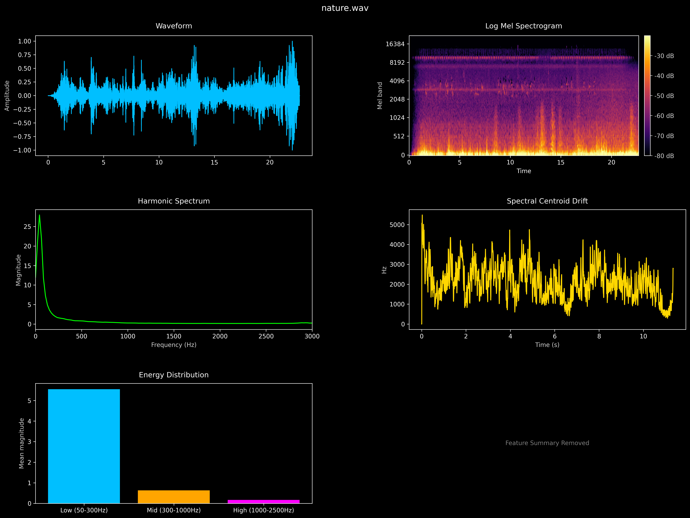
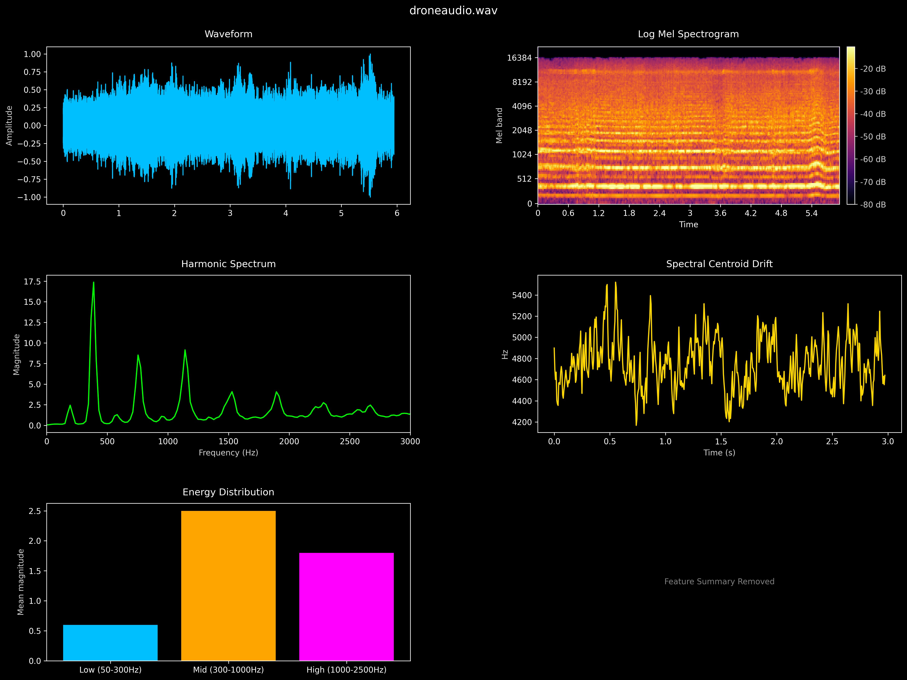
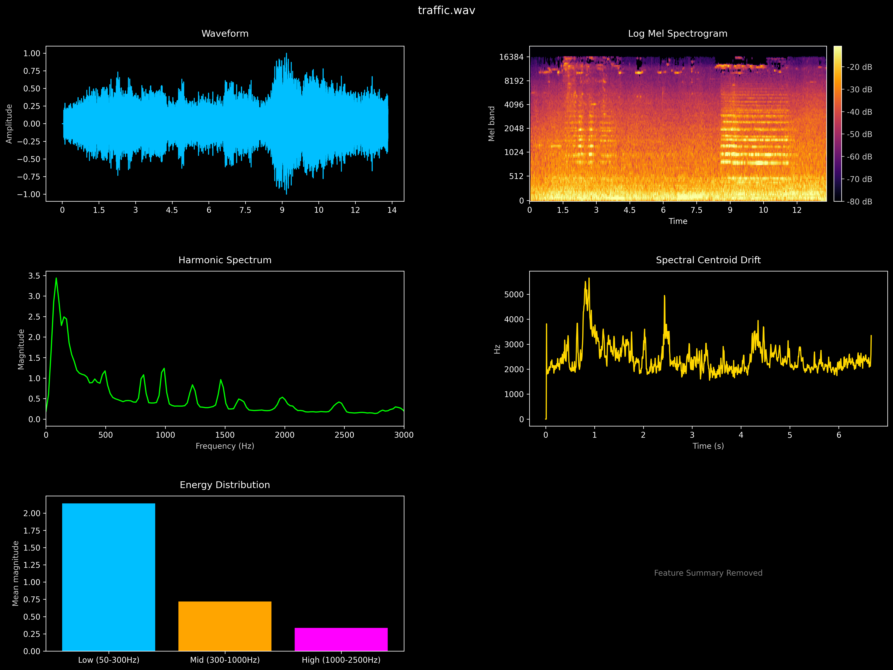

# Drone Detection Using Audio

Passive acoustic UAV detection using spectral features and a gradient-boosted classifier. No deep learning — engineered features, interpretable model.

---

## Overview

Drones produce a distinctive acoustic signature: periodic harmonic stacks from motor rotation, narrow-band energy in the 50–2500 Hz range, and high temporal stability. This system exploits those characteristics through 26 domain-specific features extracted from raw audio, fed into an XGBoost binary classifier.

```
Audio (.wav)  →  Feature Extraction (26 descriptors)  →  XGBoost  →  Drone / No Drone
```

---

## Repository Structure

```
Drone-detection-using-Audio/
├── Custom_dataset/             # Labeled audio (drone/ and background/ subdirs)
├── drone_feature_extractor.py  # Feature pipeline — 26 acoustic descriptors
├── train_xgboost.py            # XGBoost training with class-imbalance handling
├── Tester.py                   # Inference script with adjustable threshold
├── visualizations.py           # Spectrogram and analysis plots
├── drone_detector_xgb.model    # Trained model (XGBoost binary format)
├── features.csv                # Extracted feature dataset
├── Forest.png                  # Sample spectrogram — forest background
├── Near_Drone.png              # Sample spectrogram — drone audio
├── Traffic_Noise.png           # Sample spectrogram — traffic background
└── Result_analysis.mp4         # Demo of detection results
```

---

## Features Extracted

The feature set targets acoustic properties specific to multi-rotor UAVs:

| Category | Features |
|---|---|
| Harmonic | Fundamental frequency, peak count, spacing std, regularity, power ratio |
| Spectral | Centroid, spread, flatness, contrast, rolloff |
| Temporal | RMS mean/std, stability, zero-crossing rate |
| Pattern | Frequency variance, horizontal band strength, temporal correlation |
| Energy bands | Low / mid / high / very-high freq energy + ratios to total |

---

## Quickstart

**1. Install dependencies**
```bash
pip install librosa xgboost scikit-learn numpy pandas scipy soundfile tqdm
```

**2. Extract features from your dataset**
```bash
python drone_feature_extractor.py --data_dir ./Custom_dataset --output features.csv
```
Dataset must be organised as:
```
Custom_dataset/
  drone/       *.wav
  background/  *.wav
```

**3. Train the model**
```bash
python train_xgboost.py --features features.csv --output drone_detector_xgb.model
```

**4. Run inference on a new file**

Edit the paths in `Tester.py`:
```python
model.load_model(r"path/to/drone_detector_xgb.model")
file_path = r"path/to/audio.wav"
threshold = 0.3   # lower = more sensitive
```
Then:
```bash
python Tester.py
```

---

## Model

- **Algorithm:** XGBoost (`binary:logistic`)  
- **Class imbalance:** handled via `scale_pos_weight = n_background / n_drone`  
- **Threshold:** 0.3 (tuned for recall — prefers catching drones over avoiding false alarms)  
- **Input:** 26-dimensional feature vector extracted from a WAV file at 22050 Hz  

---

## Spectrogram Examples

| Forest Background | Near Drone | Traffic Noise |
|---|---|---|
|  |  |  |

Drone audio shows distinct horizontal harmonic bands. Background classes lack this structure.

---

## Dependencies

| Package | Purpose |
|---|---|
| `librosa` | Audio loading, spectral feature extraction |
| `xgboost` | Gradient boosted classifier |
| `scipy` | STFT, peak detection |
| `scikit-learn` | Train/test split, metrics |
| `soundfile` | Audio I/O |
| `numpy` / `pandas` | Numerical processing, feature tables |

---

## Citation

If you use this work, please cite:

```
@misc{drone-audio-detection,
  author = {Omprakash},
  title  = {Drone Detection Using Audio},
  year   = {2025},
  url    = {https://github.com/omp33/Drone-detection-using-Audio}
}
```

---

## LinkedIn 

https://www.linkedin.com/posts/omprakash-patel-a06703279_machinelearning-dronedetection-pytorch-ugcPost-7435358760191074304-BYQH?utm_source=share&utm_medium=member_desktop&rcm=ACoAAEPp_eYBDJlnb98bQwju5X7Qqoz8X4n3Xhg
